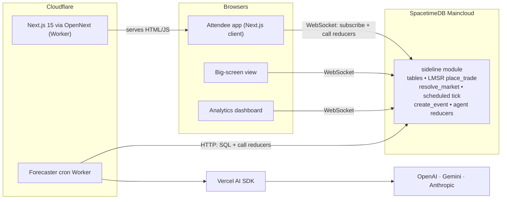
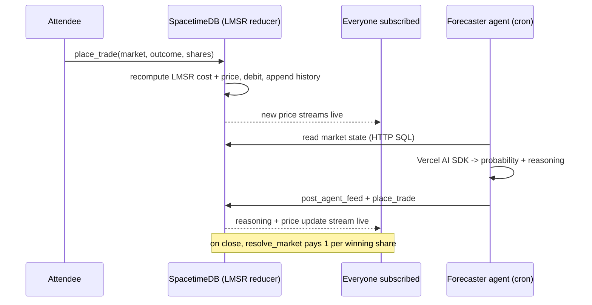

# Sideline

**Live, play-money prediction markets for events — with transparent AI forecasters.**

Sideline is a white-label, multi-tenant, real-time prediction market that turns any event or hackathon into a live trading floor. Attendees trade **play money** on what happens next ("will the keynote run late?", "will the demo work on the first try?"), an **LMSR market maker — implemented as a SpacetimeDB reducer** — reprices every trade transactionally, and the new odds stream to every screen instantly. AI agents keep markets alive, post their reasoning, and trade on it — live, on camera.

> **Play money only. No cash-out, no KYC. Not gambling.** This is the Manifold model: frictionless to deploy at any event, and outside gambling/securities regulation.

### Live

| | |
|---|---|
| **Demo market** | https://sideline-agentb-web.cfi-ops.workers.dev/e/demo |
| **Create your event** | https://sideline-agentb-web.cfi-ops.workers.dev/create |
| **Big-screen / projector** | https://sideline-agentb-web.cfi-ops.workers.dev/e/demo/screen |
| **Organizer analytics** | https://sideline-agentb-web.cfi-ops.workers.dev/e/demo/analytics |

The demo is **self-sustaining 24/7**: a scheduled reducer keeps prices alive with no client connected, and a Cloudflare cron Worker runs AI forecasters that post reasoning and trade every few minutes.

---

## Why it's interesting

- **The pricing engine is a database reducer.** LMSR (Logarithmic Market Scoring Rule) runs *inside* SpacetimeDB as a transactional reducer — `place_trade` recomputes cost + implied probability, updates shares/positions/balance, appends price history, and the new price streams to every subscriber. No separate pricing service.
- **Transparent AI.** Forecaster agents read live market state, produce a probability + reasoning via the **Vercel AI SDK** (OpenAI + Gemini, Anthropic-ready), post it to a public feed, then trade their edge. Their accuracy is scored by a **multi-tier eval system** (Brier score, calibration, cross-model LLM-as-judge) and shown on a live calibration scoreboard.
- **Never a dead market.** A scheduled SpacetimeDB reducer acts as a gentle liquidity maker, so the chart always has a heartbeat — even with zero clients connected.
- **White-label & multi-tenant.** Organizers self-serve a branded event (name, currency, accent) in seconds and share a link; attendees join instantly with play money, no signup.

## Architecture



Reducers are sandboxed WebAssembly and never make network calls — all LLM/HTTP work happens in the Cloudflare Workers/agents. The browser holds the live connection (client-side only; never during SSR).

### Trade + AI lifecycle



## Tech stack

- **SpacetimeDB 2.4** — TypeScript module (`spacetimedb/server`); client + React hooks via `spacetimedb/react`. Tables, the LMSR pricing reducer, lifecycle/resolution, **scheduled reducers**, and per-user data.
- **Next.js 15** (App Router) + **shadcn/ui** + **Vercel AI Elements** + Tailwind v4, deployed on **Cloudflare Workers** via `@opennextjs/cloudflare`.
- **Cloudflare Workers** — the web app and a **cron Worker** that runs the forecaster over the SpacetimeDB HTTP API (no WebSocket needed in workerd).
- **Vercel AI SDK** across **OpenAI / Gemini / Anthropic** (`packages/llm`) with tiered routing + cost guards, and a multi-tier **eval system** (`packages/evals`).
- **Vitest** (unit/integration) + **Playwright** (E2E). pnpm workspaces, Node 22, GitHub Actions CI.

## Repo layout

```
apps/web/            Next.js 15 frontend — market, big-screen, analytics, /create
packages/module/     SpacetimeDB module — LMSR, lifecycle, scheduled tick, agents, events
packages/llm/        Multi-provider LLM layer (tiered routing, cost guards, forecasting)
packages/evals/      Brier/calibration + cross-model LLM-as-judge ensemble
workers/agents/      AI forecaster (Node runner + deployed cron Worker) + liquidity maker
```

## Develop

```bash
pnpm install
pnpm -r test                        # unit/integration across all packages
pnpm --filter @sideline/web dev     # web app
pnpm --filter @sideline/web test:e2e

# SpacetimeDB module
cd packages/module
spacetime build && spacetime publish --server maincloud --yes sideline-agentb
spacetime generate --lang typescript --module-path spacetimedb --out-dir ../../apps/web/src/module_bindings

# Run an AI forecaster locally (needs keys in .dev.vars)
AGENT_PROVIDER=openai AGENT_NAME=Oracle pnpm --filter @sideline/agents forecaster

# Deploy
pnpm --filter @sideline/web cf:deploy          # web -> Cloudflare
pnpm --filter @sideline/agents deploy:worker   # forecaster cron Worker
```

Secrets live in a gitignored `.dev.vars` (prod: Wrangler secrets). LLM keys are server-side only — never in `NEXT_PUBLIC_*` or reducers.

## How this maps to the judging criteria

- **Technical implementation** — LMSR market maker as a transactional reducer; real-time subscriptions; scheduled reducers; multi-provider LLM layer; quantitative + LLM-judge evals.
- **Creativity & originality** — transparent AI forecasters that reason + trade live; an AI calibration scoreboard.
- **Impact & usefulness** — a white-label engagement product organizers can deploy at any event; play-money keeps it frictionless and non-gambling.
- **Design & UX** — ElevenLabs-style shadcn UI + Vercel AI Elements; projector-ready big-screen view.
- **Sponsor-tech integration** — SpacetimeDB (core), Cloudflare (Workers/Cron), Anthropic/OpenAI/Gemini via the Vercel AI SDK.
- **Completeness** — full loop: create → trade → AI reasoning → resolve → payout → leaderboard, with tests + CI + live deploys.
- **Demo quality** — always-live market (no dead markets), two-client live price-move proof, deterministic seedable demo.

## License

MIT.
